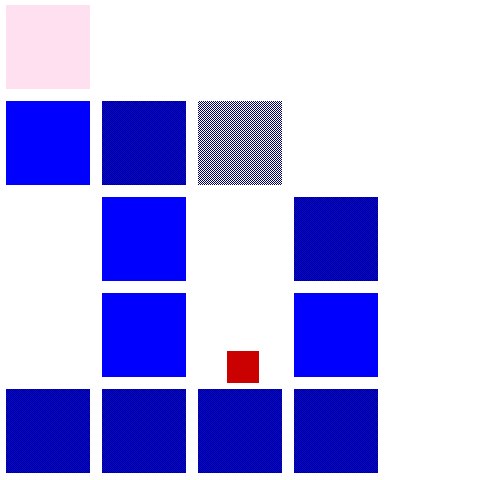
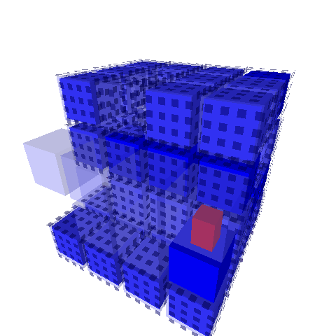

QuadriMan - The Quadri-Guy
==========================

A four-dimensional adventure.

## Introduction

"QuadriMan - The Quadri-Guy" is a proof-of-concept of a four-dimensional platformer game. It consists of two parts: "TrioMan" and "QuadriMan".

It is advised to play "TrioMan" first, which introduces you to the concept of rotating through dimensions. The world in TrioMan is in 3D, like ours, but you can only move through one 2D slice (or plane) at a time.



Once you understand rotation, you can try "QuadriMan", which adds one more dimension, letting you navigate through a four-dimensional maze. Good luck!



My initial inspiration for Quadriman was Marc ten Bosch's upcoming four-dimensional puzzle game, "Miegakure: Hide and Reveal". Feel free to check the official website at https://miegakure.com

## How to Build

QuadriMan is an open-source game written in C++, using the [SDL](http://libsdl.org) and OpenGL libraries. You will need [CMake](https://cmake.org) to build it.

### Linux
Install the tools CMake, and a C++ compiler such as `g++` from the [GNU Compiler Collection (GCC)](http://www.gnu.org/software/gcc/). Then install development libraries for SDL.

On Ubuntu Linux, this can be done with the following command on the command line:

```shell
$ sudo apt install cmake libsdl2-dev g++
```

Then run:

```shell
$ cd QuadriMan
$ mkdir build && cd build
$ cmake ..
$ cmake --build .
```

### Windows
Follow the instructions in [the following link](https://stackoverflow.com/a/44347594). Once you generate the executables, make sure you include "SDL.dll" in the executables' folder.

## License
QuadriMan is licensed under the MIT License; see the file "LICENSE.txt" for details.

This software makes use of the Simple Media Layer (SDL) library, which is available under the zlib license; see http://libsdl.org/license.php

The source code of QuadriMan includes "stb_image.h", an image loading library written in C and released to the public domain by Sean Barrett. See http://github.com/nothings/stb for more information.
